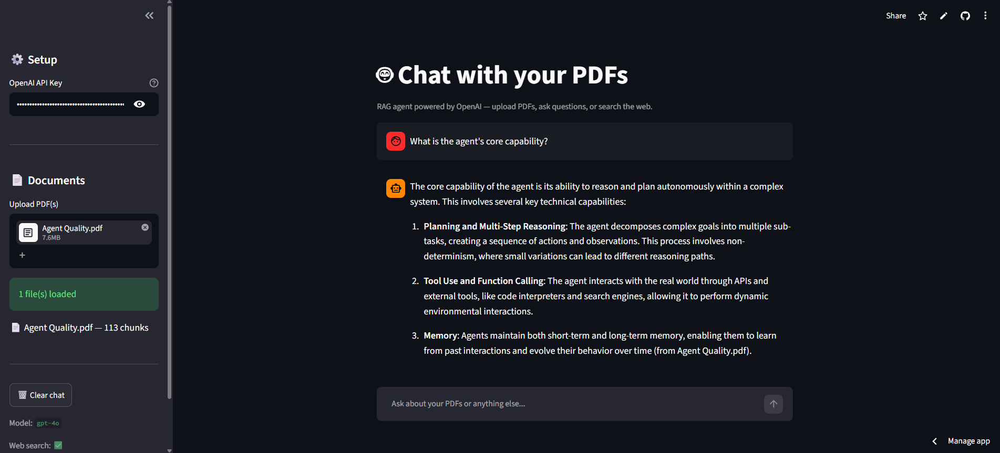

# 🤖 AI Agent — Chat with your PDFs

A conversational AI agent powered by OpenAI's GPT-4o that can **read your PDF documents and answer questions** about them using RAG (Retrieval-Augmented Generation). Also supports **web search** and **persistent memory** across sessions.


---

## 🌐 Live Demo

**Try it here:** [pdfragagent.streamlit.app](https://pdfragagent.streamlit.app/)

[](https://pdfragagent.streamlit.app/)

> **Bring your own key:** the live demo doesn't ship an API key — paste your own OpenAI key in the sidebar (it's used only for your session and never stored).

Upload a PDF in the sidebar, then ask questions about it — or ask anything and let the agent search the web.

> Deploying for the first time? See **[DEPLOY.md](DEPLOY.md)** for a 5-minute Streamlit Cloud walkthrough.

### 📸 Screenshot

<!-- TODO: take a screenshot of the running app, save it to docs/screenshot.png, and it'll show up here -->


> _Placeholder — replace `docs/screenshot.png` with an actual screenshot of your deployed app._

---

## ✨ Features

- **📄 PDF Question Answering (RAG)** — Upload PDFs and ask natural language questions. The agent finds the most relevant sections and generates accurate answers with source citations.
- **🔍 Web Search** — Searches the web via DuckDuckGo when your documents don't have the answer. No extra API key required.
- **🧠 Persistent Memory** — Conversation history is saved to disk. Restart the app and it picks up right where you left off.
- **⚡ Smart Caching** — PDF embeddings are cached locally. Load a file once and it's instantly available on every restart.
- **🛠️ Function Calling** — The agent automatically decides whether to search your documents, the web, or just reply from memory. You don't have to tell it what to do.

---

## 🏗️ Architecture

```
User Question
     │
     ▼
┌──────────┐
│  GPT-4o  │ ──── decides which tool to use
└──────────┘
     │
     ├──▶ search_documents  ──▶  Embedding similarity search over PDF chunks
     │
     └──▶ web_search        ──▶  DuckDuckGo real-time results
     │
     ▼
Final Answer (with sources)
```

**RAG Pipeline:**
1. PDFs are extracted → split into overlapping chunks (~800 chars)
2. Each chunk is embedded using `text-embedding-3-small`
3. On query, the user's question is embedded and compared via cosine similarity
4. Top 5 matching chunks are sent to GPT-4o as context
5. The model generates an answer citing the source PDF

---

## 🚀 Quick Start

### 1. Clone the repo

```bash
git clone https://github.com/amanparganiha/PdfRagAgent.git
cd PdfRagAgent
```

### 2. Install dependencies

```bash
pip install -r requirements.txt
```

### 3. Set up your API key

```bash
cp .env.example .env
```

Open `.env` and paste your OpenAI API key:

```
OPENAI_API_KEY=sk-proj-your-actual-key-here
MODEL=gpt-4o
```

> Get your key at [platform.openai.com/api-keys](https://platform.openai.com/api-keys)

### 4. Add your PDFs

Drop PDF files into the `pdfs/` folder (created automatically on first run):

```
your-project/
├── chatbot.py
├── pdfs/
│   ├── research_paper.pdf
│   └── company_report.pdf
└── ...
```

### 5. Run

**Web app (recommended):**

```bash
streamlit run app.py
```

Opens at `http://localhost:8501` — upload PDFs and chat in the browser. This is also what gets deployed (see [DEPLOY.md](DEPLOY.md)).

**Terminal version:**

```bash
python chatbot.py
```

---

## 💬 Usage

### Chat normally
```
🧑 You: What is the main conclusion of the research paper?
🤖 Agent: According to research_paper.pdf, the main conclusion is...
```

### Ask about the web
```
🧑 You: What's the latest news about OpenAI?
🤖 Agent: 🔍 Searching web...
```

### Load a PDF mid-conversation
```
🧑 You: /load C:\Users\me\Documents\notes.pdf
📄 Processing: notes.pdf
   ✂️ Split into 24 chunks
   📊 Embedded 24/24 chunks
   ✅ Done!
```

### Slash Commands

| Command | Description |
|---------|-------------|
| `/load <path>` | Load a PDF file into the agent |
| `/docs` | List all loaded documents and chunk counts |
| `/clear` | Reset conversation memory |
| `/history` | View last 10 messages |
| `quit` | Exit the agent |

---

## ⚙️ Configuration

All settings are in the top section of `chatbot.py`:

| Setting | Default | Description |
|---------|---------|-------------|
| `EMBEDDING_MODEL` | `text-embedding-3-small` | OpenAI embedding model |
| `CHUNK_SIZE` | `800` | Characters per text chunk |
| `CHUNK_OVERLAP` | `200` | Overlap between chunks for context continuity |
| `TOP_K` | `5` | Number of chunks retrieved per query |
| `MAX_HISTORY` | `50` | Max messages kept in conversation memory |

You can also change `MODEL` in your `.env` file to use `gpt-4o-mini` or `gpt-3.5-turbo` for cheaper usage.

---

## 📁 Project Structure

```
.
├── app.py              # Streamlit web UI (deployed version)
├── chatbot.py          # Terminal/CLI version
├── requirements.txt    # Python dependencies
├── DEPLOY.md           # Deployment guide (Streamlit Cloud, etc.)
├── .env.example        # Template for API keys (CLI / local)
├── .env                # Your actual keys (git-ignored)
├── .gitignore          # Keeps secrets & caches out of git
├── .streamlit/
│   └── secrets.toml.example   # Key template for Streamlit (git-ignored when real)
├── docs/
│   └── screenshot.png  # App screenshot for the README
├── pdfs/               # Drop your PDF files here, CLI only (git-ignored)
└── memory/             # CLI persistence (git-ignored)
    ├── chat_history.json   # Conversation memory
    └── embeddings/         # Cached PDF embeddings
```

> **Note:** The web app (`app.py`) keeps chat and embeddings in the browser session rather than the `memory/` folder, since cloud hosts have ephemeral disks. The `pdfs/` and `memory/` folders are used by the CLI version.

---

## 💰 Cost Estimate

| Action | Model | Approx. Cost |
|--------|-------|-------------|
| Embed a 50-page PDF | `text-embedding-3-small` | ~$0.002 |
| One chat message | `gpt-4o` | ~$0.01–0.03 |
| One chat message | `gpt-4o-mini` | ~$0.001 |
| Web search | DuckDuckGo | Free |

Embeddings are cached, so you only pay once per PDF.

---

## 🛡️ Security

- API keys are stored in `.env` and **never committed to git**
- `.gitignore` excludes `.env`, `memory/`, and `pdfs/`
- No data is sent anywhere except OpenAI's API

> ⚠️ **Never hardcode your API key in the source code.** If you accidentally push a key to GitHub, revoke it immediately at [platform.openai.com/api-keys](https://platform.openai.com/api-keys).

---

## 🤝 Contributing

Pull requests are welcome! Some ideas for improvements:

- [ ] Support for more file types (Word, TXT, CSV)
- [ ] Streaming responses
- [x] Web UI with Streamlit or Gradio
- [ ] Multiple conversation threads
- [ ] Summarize entire documents
- [ ] Token usage tracking

---

## 📄 License

MIT License — use it however you want.
